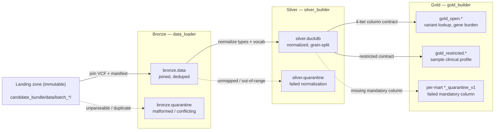

# inocras_datalayers

Genomic data foundation — ingests somatic VCF + sample manifest batches into a
governed, queryable curated zone. See [`AGENTS.md`](AGENTS.md) for the full operating
context and [`working_contexts/`](working_contexts/) (highest version number) for the
current architecture and resolved decisions.

## At a glance

- Three layers, three CLIs: **bronze** (`data-loader`) joins raw VCF + manifest
  batches into a fidelity-preserving audit trail; **silver** (`silver-builder`)
  normalizes and splits into a trust-layer schema; **gold** (`gold-builder`) builds
  purpose-scoped marts, one per research question.
- **Nothing is ever silently dropped.** Every record lands in exactly one place at
  each layer — a table, or that table's `_quarantine` sibling — enforced as a
  reconciliation invariant, checked in code, not assumed.
- 105 tests, all passing, every number in this doc checked against real pipeline
  output — not asserted from the design docs alone.
- Deep dives live in [`docs/`](docs/): [governance](docs/governance.md),
  [operations](docs/operations.md), and per-layer architecture for
  [bronze](docs/data_architecture/bronze.md), [silver](docs/data_architecture/silver.md),
  [gold](docs/data_architecture/gold.md).



## Repository layout

```
inocras_datalayers/
├── candidate_bundle/data/   SOURCE — immutable landing zone, never written to
├── data_loader/             bronze layer CLI (data-loader)
├── silver_builder/          silver layer CLI (silver-builder)
├── gold_builder/            gold layer CLI (gold-builder)
├── config/
│   ├── crosswalks/          silver's vocabulary mappings (tissue, platform, ...)
│   └── gold_contracts/      gold's per-mart 4-tier column contracts
├── tests/                   105 tests, one file per module
├── warehouse/               GENERATED — bronze/silver/gold output, gitignored
├── docs/                    deep-dive documentation (governance, operations, per-layer)
├── conductor/                Conductor tracks (spec → plan → implement records)
├── working_contexts/        versioned architecture decisions (highest v<N> wins)
├── AGENTS.md / CLAUDE.md    operating rules for AI agents working in this repo
├── data_context.md          landing-zone data contract
└── pyproject.toml           dependencies + the three CLIs' script entry points
```

`main.py` at the repo root is an unused scaffold stub from initial setup — none of
the three real CLIs go through it (each has its own `cli.py`, wired via
`pyproject.toml`'s `[project.scripts]`); left out of the tree above deliberately.

## Setup

```bash
uv sync
```

Requires Python 3.14+ (pinned via `.python-version`). No cloud accounts, no external
services — everything runs locally.

## How to operate

### Quickstart — the whole pipeline, one clean checkout

```bash
uv sync
uv run data-loader batch_2026_01
uv run data-loader batch_2026_02
uv run silver-builder
uv run gold-builder
uv run pytest
```

Each command is idempotent to re-run, but not in the same way at every layer — see
[operations: idempotency](docs/operations.md#operational-posture) for the exact
guarantee per layer.

### Bronze layer — `data_loader`

`data-loader` ingests **one batch at a time** from the landing zone, joins its
VCF + manifest, and writes the result into `warehouse/bronze/` — this is the
only one of the three CLIs that takes a required argument (which batch).

```bash
uv run data-loader batch_2026_01
# -> batch_2026_01: 795 rows written, 2 quarantined, 0 exact duplicates collapsed
```

**Options:**
- `batch_id` (positional, **required**) — e.g. `batch_2026_01`; must be a
  non-empty subdirectory of `--data-root`.
- `--data-root` (default `candidate_bundle/data`) — landing-zone root to read
  `<batch_id>/` from.
- `--out-root` (default `warehouse`) — warehouse root; `bronze/data/` and
  `bronze/quarantine/` are created under it.

More example invocations, non-default roots: [docs/data_architecture/bronze.md#command-and-options](docs/data_architecture/bronze.md#command-and-options).

- Writes two Parquet files per run, **never overwritten**: `bronze/data/<batch_id>/`
  (every combinable record, `NULL` where a side is legitimately missing) and
  `bronze/quarantine/<batch_id>/` (only records that couldn't be parsed or safely
  combined at all).
- Verified against real data: `batch_2026_01` → 795 rows written, 2 quarantined
  (`S-0011`'s conflicting manifest duplicate); `batch_2026_02` → 295 rows written,
  1 quarantined (`S-0020`'s truncated line).
- A design gap was caught mid-build: `S-0011` was originally spec'd to be entirely
  absent from `bronze.data`, which would have silently dropped its valid variant
  calls — fixed to land with manifest columns `NULL` instead. Full story in the
  [AI assistance note](#ai-assistance-note) below.

**Inspecting output** — bronze writes Parquet, not a database; the
[DuckDB CLI](https://duckdb.org/docs/installation/) reads Parquet directly, no
loading step. Prerequisite: `brew install duckdb` (macOS/Homebrew; see the link
above for other platforms) — the project's Python `duckdb` dependency doesn't
install the standalone CLI binary.

```bash
# landed rows for a batch (latest run — glob picks up every timestamped file)
duckdb -c "SELECT * FROM 'warehouse/bronze/data/batch_2026_01/*.parquet' LIMIT 5"

# quarantined rows + why — reason_code/reason_detail carry the actual cause
duckdb -c "SELECT reason_code, reason_detail, raw_text
           FROM 'warehouse/bronze/quarantine/batch_2026_01/*.parquet'"
```

→ [Full bronze architecture, internal-flow diagram, exit codes](docs/data_architecture/bronze.md)

### Silver layer — `silver_builder`

`silver-builder` reads **every** batch's bronze output in one run (no batch
argument — unlike `data-loader`), normalizes it, and rebuilds the whole
trust-layer schema in `warehouse/silver.duckdb`.

```bash
uv run silver-builder
# -> silver_builder: read 1090 rows from 2 bronze file(s) -> 20 samples,
#    1089 variant calls, 0 quarantined -> warehouse/silver.duckdb
```

**Options** (all optional — bare `silver-builder` auto-discovers everything):
- `--data-files FILE [FILE ...]` — explicit `data_*.parquet` paths;
  **overrides auto-discovery entirely**. Use to rebuild from one specific
  bronze run while troubleshooting, e.g.
  `--data-files warehouse/bronze/data/batch_2026_01/data_<timestamp>.parquet`.
- `--bronze-data-root` (default `warehouse/bronze/data`) — root to
  auto-discover bronze data files under (ignored if `--data-files` is given).
- `--bronze-quarantine-root` (default `warehouse/bronze/quarantine`) — root to
  auto-discover bronze quarantine files under, for audit counts only; doesn't
  affect what gets built.
- `--out-root` (default `warehouse`) — warehouse root; `silver.duckdb` is
  written here.

More example invocations: [docs/data_architecture/silver.md#command-and-options](docs/data_architecture/silver.md#command-and-options).

- **Running it bare, repeatedly, is safe** — auto-discovery reads only the
  *latest* file per batch (not every `data-loader` run ever made), and every
  table is a full `CREATE OR REPLACE`, never an append. No conflicts, no
  duplicate rows. [Full reasoning](docs/data_architecture/silver.md#command-and-options).
- Normalizes `tumor_purity` and all VCF allele-frequency-like fields to `[0,1]`;
  maps categorical fields to controlled vocabularies via
  `config/crosswalks/*.yaml` — an unmapped value quarantines, never guessed at.
- Full rebuild every run (`CREATE OR REPLACE TABLE`) — deterministic, no
  incremental-state bugs.
- Verified against real bronze output: 1090 rows in → 20 samples, 1089 variant
  calls, 0 silver-level quarantines. `TP53` has 57 variants but only 17 distinct
  patients — exactly the denominator trap `n_distinct_patients` exists to prevent.
- A real data-quality bug was found and fixed here, not assumed away: `batch_2026_02`'s
  `VAF` was on a 0–100 scale against `batch_2026_01`'s 0–1. Full story in the
  [AI assistance note](#ai-assistance-note) below.

→ [Full silver architecture, internal-flow diagram, exit codes](docs/data_architecture/silver.md)

### Gold layer — `gold_builder`

`gold-builder` reads `warehouse/silver.duckdb` and rebuilds **every** mart
contract found in `config/gold_contracts/` in one run (no batch or file
argument at all — it always reads all of silver's current state).

```bash
uv run gold-builder
# -> gold-builder: -> warehouse/gold.duckdb
#      gold_cohort_gene_burden_v1: 36 rows, 0 quarantined
#      gold_sample_clinical_profile_v1: 17 rows, 3 quarantined
#      gold_variant_gene_lookup_v1: 1032 rows, 57 quarantined
```

**Options** (all optional):
- `--mart NAME [NAME ...]` (default: build all) — restrict the run to just
  these mart(s), e.g. `--mart gold_variant_gene_lookup_v1`. Faster when
  iterating on a single contract.
- `--silver-db` (default `warehouse/silver.duckdb`) — path to silver's DuckDB
  file to read from.
- `--out-root` (default `warehouse`) — warehouse root; `gold.duckdb` is
  written here.

More example invocations: [docs/data_architecture/gold.md#command-and-options](docs/data_architecture/gold.md#command-and-options).

- Reads `warehouse/silver.duckdb` and writes **purpose-scoped marts** to
  `warehouse/gold.duckdb` — one mart per research question, each with its own
  4-tier column contract (`mandatory`/`good_to_have`/`okay_to_have`/`not_relevant`)
  rather than one generic schema.
- **Running it bare, repeatedly, is also safe** — gold reads a single
  already-fully-rebuilt silver database, not a set of files to reconcile, and
  every mart is `CREATE OR REPLACE`. No auto-discovery ambiguity to reason
  about at all.
- Three marts: `gold_variant_gene_lookup_v1` and `gold_cohort_gene_burden_v1`
  (`gold_open`), `gold_sample_clinical_profile_v1` (`gold_restricted`, exact
  dates/purity for correlation work).
- Only a `mandatory`-tier `NULL` excludes a row (quarantined, with a reason);
  `not_relevant` columns are absent from the schema entirely, not just nullable.
  The same silver row can be excluded from one mart and fully counted in another.
- Verified against real silver output: `gold_variant_gene_lookup_v1` → 1032 rows,
  57 quarantined (all `S-0011`); `gold_cohort_gene_burden_v1` → 36 rows, 0
  quarantined; `gold_sample_clinical_profile_v1` → 17 rows, 3 quarantined.
- A silent SQL undercount was found and fixed before shipping: `COUNT(DISTINCT
  patient_id)` silently drops `NULL`, which would have hidden `S-0011`'s 3 `TP53`
  variants from every count. Full story in the
  [AI assistance note](#ai-assistance-note) below.

→ [Full gold architecture, internal-flow diagram, exit codes](docs/data_architecture/gold.md)

### Running tests

```bash
uv run pytest
```

105 tests across bronze/silver/gold. Every test that references a specific real
number (`TP53` → 57/19/17/1, `S-0011`'s 57 variant rows, etc.) was checked against
the actual pipeline output, not asserted from the design docs alone.

Full command/option reference for each CLI now lives with its layer, above —
[bronze](docs/data_architecture/bronze.md#command-and-options),
[silver](docs/data_architecture/silver.md#command-and-options),
[gold](docs/data_architecture/gold.md#command-and-options) — each with its
reads/writes/exit-code table and example runs with real output.

## Governance posture

*(Required by the brief: "how would you handle de-identification and access
control before researchers touch this, and what would you document so an AI
assistant could answer questions on this data reliably?")*

- **De-identification is per-tier, not global** — each `gold_open` mart drops
  (not merely masks) any quasi-identifying column it doesn't need; `patient_id`
  and `collection_date` never appear in `gold_variant_gene_lookup_v1` at all.
- **The honest limitation:** at n=20, k-anonymity isn't achievable by
  generalisation (binning `collection_date` to month only gets to 9/20-unique),
  and the variant data is itself an identifier — 30–80 common SNPs uniquely
  identify a person. **The control is access, not anonymisation.**
- **The `gold_open`/`gold_restricted` split is structural, not enforced** —
  checked directly: embedded DuckDB has no `GRANT`/role system. Real enforcement
  is the production S3-to-S3 mapping, one IAM role per zone, each able to read
  exactly one zone and write exactly one.
- **What an AI assistant needs to answer reliably:** each mart's declared
  `purpose`/`grain`; denominator-safe column names (never a bare `count`); that a
  `_quarantine_v1` sibling is data that failed *that mart's* contract, not bad
  data; that `not_relevant` means a column is absent, not `NULL`.

→ [Full governance posture, S3/IAM diagram](docs/governance.md)

## Operational posture

- **Idempotency differs by design, per layer** — bronze keeps every run (new
  timestamped file, audit trail); silver and gold fully rebuild
  (`CREATE OR REPLACE TABLE`, current-best-understanding, not an audit trail).
- **Every layer asserts a reconciliation invariant before declaring success** —
  a non-zero exit `2` is a bug in the code, never a property of messy input
  (messy input is quarantine, which is exit `0`). Bronze uses two independent
  checks (not one combined formula); silver and gold each assert every source
  row lands in exactly one of {table, quarantine}.
- **Troubleshooting:** exit `1` means "nothing to read" (check the path); exit
  `2` means a reconciliation assertion failed — isolate inputs
  (`--mart`, `--data-files`) to find which record broke it.
- **Next-phase recommendation:** the agentic vocabulary-authoring loop
  (`working_contexts/` v2 §4.4) has its runtime half built — deterministic
  lookup, never an LLM in the execution path — but the authoring half (what
  happens the *next* time a value is unmapped) isn't yet a distinct tool. A
  full flow for this — review → agent proposes → human approves → commit to
  crosswalk YAML — is designed and ready to build, kept deliberately separate
  from the three deterministic pipeline CLIs.

→ [Full operational posture, reconciliation invariants, unmapped-vocabulary review flow](docs/operations.md)

## AI assistance note

Built with Claude Code, using the Conductor plugin's spec → phased plan → implement
workflow. Every phase's key claims were verified by running code against the real
batch data, not asserted from the plan alone.

- **Bronze — a design gap caught, not just implemented as specified.** The
  original spec said `S-0011` should be entirely absent from `bronze.data`
  because its manifest rows conflict — testing showed this would silently drop
  that sample's independently-valid variant calls. Surfaced as a design fork,
  not resolved silently; fixed so `S-0011`'s variants land with manifest
  columns `NULL`. The reconciliation formula was also revised mid-build: a
  single combined equation didn't actually balance once the join's merge
  behavior was worked through, so it became two independent checks instead.
- **Silver — a real data-quality finding, not in the original scope.**
  `batch_2026_02`'s `VAF` turned out to be on a 0–100 scale against
  `batch_2026_01`'s 0–1 — confirmed by cross-checking `AD`/`DP`
  (`32/57=0.5614` vs. the file's `56.14`, exactly ×100), not assumed. Fixed via
  `normalize_af()`. Also self-corrected a false alarm along the way: an initial
  `MAX_POP_AF` outlier flag turned out to be a bug in my own `grep` regex
  (truncating `9.6e-06` to `9.6`), not real data — caught before it shipped.
- **Gold — a genuine silent-undercount, found before implementation.**
  `n_distinct_patients = COUNT(DISTINCT patient_id)` would have silently
  excluded `S-0011` from every gene's patient count, since SQL's
  `COUNT(DISTINCT ...)` drops `NULL` silently. Confirmed directly: `S-0011`
  contributes 3 real `TP53` variants (57 vs. 54 without it) that would never
  have shown up. Fixed by adding `n_samples_with_unknown_patient` as its own
  column before any code was written against the flawed design.
- **Documentation pass — the agentic-authoring gap named directly.** Asked
  directly why the agentic vocabulary-authoring loop (`working_contexts/` v2
  §4.4) wasn't visible anywhere — the honest answer: only its runtime half got
  built; the authoring half happened informally while writing the crosswalk
  YAML files, with no separate artifact or tooling for future unmapped values.
  Recorded as an explicit next-phase recommendation rather than silently built
  without sign-off, or silently left undocumented.
