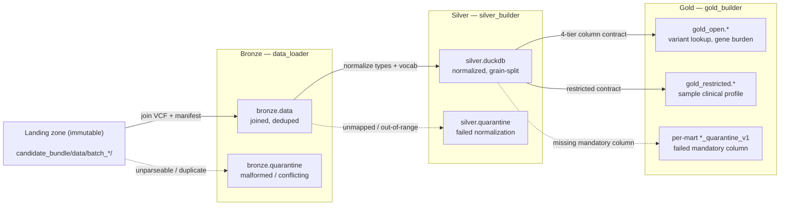
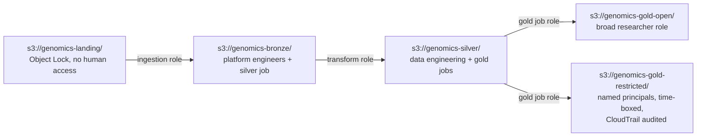
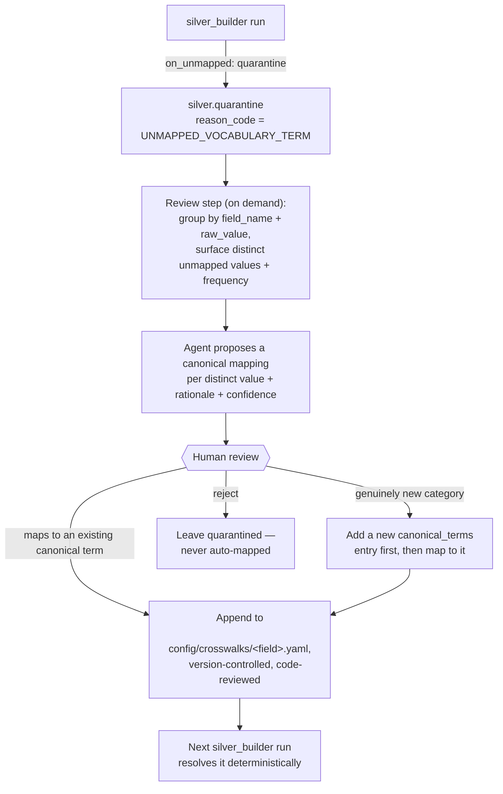

# inocras_datalayers

Genomic data foundation — ingests somatic VCF + sample manifest batches into a
governed, queryable curated zone. See [`AGENTS.md`](AGENTS.md) for the full operating
context and [`working_contexts/`](working_contexts/) (highest version number) for the
current architecture and resolved decisions.

## Architecture at a glance



**Nothing is ever silently dropped.** Every record lands in exactly one place at each
layer — a mart, or that mart's `_quarantine` sibling — and each layer asserts this as
a reconciliation invariant, not a hope.

## Repository layout

```
inocras_datalayers/
├── candidate_bundle/data/   SOURCE — immutable landing zone, never written to
├── data_loader/             bronze layer CLI (data-loader)
├── silver_builder/          silver layer CLI (silver-builder)
├── gold_builder/            gold layer CLI (gold-builder)
├── config/
│   ├── crosswalks/          silver's vocabulary mappings (tissue, platform, ...)
│   └── gold_contracts/      gold's per-mart 4-tier column contracts
├── tests/                   105 tests, one file per module
├── warehouse/               GENERATED — bronze/silver/gold output, gitignored
├── conductor/                Conductor tracks (spec → plan → implement records)
├── working_contexts/        versioned architecture decisions (highest v<N> wins)
├── AGENTS.md / CLAUDE.md    operating rules for AI agents working in this repo
├── data_context.md          landing-zone data contract
└── pyproject.toml           dependencies + the three CLIs' script entry points
```

`main.py` at the repo root is an unused scaffold stub from initial setup — none of
the three real CLIs go through it (each has its own `cli.py`, wired via
`pyproject.toml`'s `[project.scripts]`); left out of the tree above deliberately.

## Setup

```bash
uv sync
```

Requires Python 3.14+ (pinned via `.python-version`). No cloud accounts, no external
services — everything runs locally.

## How to operate

### Quickstart — the whole pipeline, one clean checkout

```bash
uv sync
uv run data-loader batch_2026_01
uv run data-loader batch_2026_02
uv run silver-builder
uv run gold-builder
uv run pytest
```

Each command is idempotent to re-run (see **Operational posture** below for exactly
what "idempotent" means per layer — it's not the same guarantee at every layer, on
purpose).

### Bronze layer — `data_loader`

Ingests one batch at a time from `candidate_bundle/data/` into `warehouse/bronze/`:

```bash
uv run data-loader batch_2026_01
uv run data-loader batch_2026_02
```

Equivalent module form: `uv run python -m data_loader batch_2026_01`. Optional flags
(defaults shown): `--data-root candidate_bundle/data --out-root warehouse`.

**Output:** two Parquet files per run, one per batch, never overwritten —

```
warehouse/bronze/data/<batch_id>/data_<timestamp>.parquet
warehouse/bronze/quarantine/<batch_id>/quarantine_<timestamp>.parquet
```

`data` holds every combinable record (joined variant + manifest, `NULL` where a side
is legitimately missing). `quarantine` holds only records that couldn't be parsed or
safely combined at all (malformed lines, conflicting duplicate manifest rows).

> **Status:** bronze layer complete
> (`conductor/tracks/_archive/bronze-layer_20260823/`, all 6 phases). Verified
> against both real batches: `batch_2026_01` → 795 rows written, 2 quarantined
> (`S-0011`'s conflicting manifest duplicate); `batch_2026_02` → 295 rows written, 1
> quarantined (`S-0020`'s truncated line).

### Silver layer — `silver_builder`

Reads bronze's `data` Parquet output, normalizes types and vocabulary, and writes a
trust-layer schema (patients/samples/variant_calls/batches, plus a
normalization-failure quarantine) to `warehouse/silver.duckdb`:

```bash
uv run silver-builder
```

By default it auto-discovers each batch's latest `data_*.parquet` under
`warehouse/bronze/data/`. To rebuild from a specific bronze run instead:

```bash
uv run silver-builder --data-files warehouse/bronze/data/batch_2026_01/data_<timestamp>.parquet [...]
```

**What it does that bronze didn't:**
- Normalizes `tumor_purity` and all VCF-native allele-frequency-like fields
  (`VAF`, `MAX_POP_AF`, `GNOMAD_AF_POPMAX`, `CCF`) to `[0,1]` fractions.
- Maps `tissue`/`sequencing_platform`/`library_prep`/`qc_status` to controlled
  vocabularies via `config/crosswalks/*.yaml` — an unmapped value quarantines,
  never guessed at (see **Next phase: unmapped-vocabulary review**, below).
- Splits bronze's flat, denormalized rows into grain-correct tables:
  `patients` (one row per patient), `samples` (one row per sample, with a
  `has_variant_data` flag), `variant_calls` (one row per sample × variant).
- Full rebuild every run (`CREATE OR REPLACE TABLE`) — deterministic, no
  incremental-state bugs.

> **Status:** silver layer complete
> (`conductor/tracks/_archive/silver-layer_20260823/`, all 6 phases). Verified
> against real bronze output for both batches: 1090 rows in → 20 samples, 1089
> variant calls, 0 silver-level quarantines (the known real-data defects were
> already handled at bronze). Example queries confirmed against real data: `TP53`
> has 57 variants but only 17 distinct patients — the exact denominator trap
> `n_distinct_patients` exists to prevent.

### Gold layer — `gold_builder`

Reads `warehouse/silver.duckdb` and writes **purpose-scoped marts** to
`warehouse/gold.duckdb` — one mart per research question, each with its own
column-relevancy contract rather than one generic schema:

```bash
uv run gold-builder
```

Builds every contract found in `config/gold_contracts/`. To build just one:

```bash
uv run gold-builder --mart gold_variant_gene_lookup_v1
```

**The three marts:**

| Mart | Schema | Grain | Answers |
|---|---|---|---|
| `gold_variant_gene_lookup_v1` | `gold_open` | (sample, variant) | *"Which samples carry a variant in gene X, and what tissue/diagnosis are they from?"* |
| `gold_cohort_gene_burden_v1` | `gold_open` | gene | *"How many variants per gene, and how many distinct patients?"* |
| `gold_sample_clinical_profile_v1` | `gold_restricted` | sample | Full-fidelity clinical context for correlation work needing exact dates/purity |

**Each mart's columns are tiered** `mandatory` / `good_to_have` / `okay_to_have` /
`not_relevant` (`config/gold_contracts/*.yaml`) — only a `mandatory`-tier `NULL`
excludes a row (quarantined, with a reason); lower tiers never exclude, they just
land `NULL`; `not_relevant` columns are dropped from that mart's schema entirely,
not merely left nullable. The same silver row can be excluded from one mart and
fully counted in another — both correct, for different reasons. Concrete, verified
example: `S-0011` (its manifest fields are `NULL` — a bronze-layer decision, not a
defect) is excluded from `gold_variant_gene_lookup_v1` (`tissue` is `mandatory`
there) but its 3 `TP53` variants are still counted in
`gold_cohort_gene_burden_v1`'s `n_variants` — while correctly *not* counted in
`n_distinct_patients` (its `patient_id` is `NULL`, and SQL's
`COUNT(DISTINCT ...)` silently drops `NULL` — a real gap found while building this,
fixed by adding `n_samples_with_unknown_patient` as its own column so the gap is
visible instead of hidden).

> **Status:** gold layer complete
> (`conductor/tracks/_archive/gold-layers_20260823/`, all 6 phases). Verified
> against real silver output: `gold_variant_gene_lookup_v1` → 1032 rows, 57
> quarantined (all `S-0011`); `gold_cohort_gene_burden_v1` → 36 rows (one per
> gene), 0 quarantined; `gold_sample_clinical_profile_v1` → 17 rows, 3 quarantined
> (`S-0003` missing `tumor_purity`, `S-0011` fully `NULL`, `S-0012` missing
> `collection_date` — all three previously-known real gaps in the source manifest,
> not new surprises).

### Running tests

```bash
uv run pytest
```

105 tests across bronze/silver/gold. Every test that references a specific real
number (`TP53` → 57/19/17/1, `S-0011`'s 57 variant rows, etc.) was checked against
the actual pipeline output, not asserted from the design docs alone.

### CLI reference

| | `data-loader` | `silver-builder` | `gold-builder` |
|---|---|---|---|
| Reads | `candidate_bundle/data/<batch_id>/` | `warehouse/bronze/data/` | `warehouse/silver.duckdb` |
| Writes | `warehouse/bronze/{data,quarantine}/` | `warehouse/silver.duckdb` | `warehouse/gold.duckdb` |
| Exit `0` | success | success | success |
| Exit `1` | batch folder missing/empty | no bronze data files found | `--silver-db` not found |
| Exit `2` | reconciliation invariant failed | reconciliation invariant failed | reconciliation or schema-minimization invariant failed |
| Idempotency | new timestamped file per run, **never overwrites** | full rebuild (`CREATE OR REPLACE`) every run | full rebuild (`CREATE OR REPLACE`) every run |

## Governance posture

*(Required by the brief: "how would you handle de-identification and access
control before researchers touch this, and what would you document so an AI
assistant could answer questions on this data reliably?")*

**De-identification is per-tier, not global** — each `gold_open` mart drops
(rather than merely masks) any quasi-identifying column it doesn't need for its
specific purpose (`gold_variant_gene_lookup_v1` never carries `patient_id` or
`collection_date` at all, not even generalised — the question it answers doesn't
need them). `gold_restricted.gold_sample_clinical_profile_v1` carries exact dates
and purity, gated to narrow, named, audited access.

**The honest limitation, stated plainly, not implied away:** at n=20, k-anonymity
is not achievable by generalisation — binning `collection_date` to month only moves
the cohort from 20/20-unique to 9/20-unique (`working_contexts/` v1 §4), and more
fundamentally, **the variant data is itself an identifier** (30–80 common SNPs
uniquely identify a person and their biological relatives) — stripping names from a
VCF is not de-identification in any meaningful sense. **The control is access, not
anonymisation.** Column minimization via the 4-tier contract model reduces each
mart's attack surface; it is not a claim that the data is anonymous.

**The `gold_open`/`gold_restricted` schema split is structural, not enforced
access control** — checked directly: embedded DuckDB has no `GRANT`/role system
(`GRANT SELECT ON SCHEMA ... TO ...` is a parser error). Real enforcement is the
production S3-to-S3 mapping, one IAM role per zone:



Each arrow is a separate IAM role that can read exactly one zone and write exactly
one — no principal can read landing and write gold. *(Full detail:
`working_contexts/` v2 §6.3.)* This repo's local schema split is the structural
analog of that boundary, not the boundary itself.

**What an AI assistant needs, to answer reliably rather than guess:** each mart's
declared `purpose` and `grain` (in its contract YAML, and queryable from
`DESCRIBE`); denominator-safe column names (`n_variants` vs. `n_distinct_patients`
vs. `n_samples_with_unknown_patient` — never a bare `count`); the quarantine
semantics note above (`_quarantine_v1` siblings are *not* bad data — they're data
that didn't meet *that mart's* contract, and may be valid elsewhere); and the fact
that `not_relevant` means a column is absent, not that it happened to be `NULL`.

## Operational posture

**Idempotency means something different at each layer, deliberately:**

- **Bronze keeps every run.** Each run of `data_loader` writes a brand-new
  timestamped file and never deletes or overwrites a previous one — bronze is the
  audit trail. Re-running twice produces two files, not data loss or duplication
  within a file.
- **Silver and gold fully rebuild.** Both use `CREATE OR REPLACE TABLE` from
  whatever bronze/silver output they're pointed at — deterministic,
  no incremental-state bugs, but a run genuinely replaces the previous one. Silver
  and gold are *current-best-understanding*, not an audit trail — that's bronze's
  job, and only bronze's.

**Every layer enforces a reconciliation invariant before declaring success** — a
non-zero exit `2` means the invariant failed, which is a bug in the code, never a
property of messy input data (messy input is handled by quarantine, which is exit
`0`):

- Bronze: **two independent checks**, not one combined formula (a single equation
  doesn't actually balance once the manifest↔VCF join's merge behavior is accounted
  for — see the AI assistance note below) — manifest:
  `lines_read == usable + quarantined + duplicates_collapsed`; VCF:
  `lines_quarantined <= lines_read`.
- Silver: every distinct `sample_id` in the bronze input lands in exactly one of
  `silver.samples` or `silver.quarantine`.
- Gold: per mart, every source row lands in exactly one of the mart or its
  `_quarantine` sibling (the aggregate mart's version: `sum(n_variants) +
  quarantined == source row count`).

**Troubleshooting a non-zero exit:** exit `1` across all three tools means "nothing
to read" (check the path you passed); exit `2` means a reconciliation assertion
failed — re-run with the same inputs isolated (e.g. `--mart` on `gold-builder`, or a
single `--data-files` on `silver-builder`) to narrow down which record broke the
invariant, and treat it as a bug to fix in the layer that raised it, not a data
problem to route around.

### Next phase: unmapped-vocabulary review

`working_contexts/` v2 §4.4 designed an **agentic authoring loop** for silver's
vocabulary crosswalks: an agent proposes a canonical mapping, a human approves it,
the mapping is committed to `config/crosswalks/*.yaml`, and the pipeline itself
stays a pure, deterministic lookup at runtime — never an LLM call in the execution
path. That runtime half is built. **The authoring-loop half — what happens the
*next* time an unmapped value shows up — is not yet a distinct tool.** Today,
`on_unmapped: quarantine` is the entire story: an unrecognized value lands in
`silver.quarantine` and stops there.

Recommended flow for the next phase, kept deliberately **separate** from the three
existing pipeline CLIs — it runs on demand against accumulated quarantine data, not
as part of any deterministic run:



Why this shape: never automatic (same human-approval boundary v2 §4.4 already
drew, just extended to future values); batch-triggered rather than continuous
(keeps the pipeline itself fast and deterministic); the commit is the audit trail
(a crosswalk change is a normal, reviewable git diff, not "the model decided");
and rejection is a valid outcome (not every unmapped value should be force-mapped —
some are genuinely bad data). **Not built this pass** — a small CLI following the
same pattern as the three existing tools, recorded here as a deliberate deferral
with a reason, not a silent gap.

## AI assistance note

Built with Claude Code, using the Conductor plugin's spec → phased plan → implement
workflow. Every phase's key claims were verified by running code against the real
batch data, not asserted from the plan alone — e.g. `S-0020`'s truncation was checked
directly against the actual file, not just a test fixture.

**Where a design gap was caught, not just implemented as specified:** Phase 5 testing
found the original spec's claim — that `S-0011` should be entirely absent from
`bronze.data` because its manifest rows conflict — was actually wrong: it would have
silently dropped that sample's independently-valid variant calls over an unrelated
field's ambiguity. Surfaced to the user as a design fork rather than resolved
silently; `S-0011`'s variants now land with manifest columns `NULL`, same as `S-0008`'s
gap. `spec.md`, `plan.md`, and the tests were all corrected to match. Phase 6's
reconciliation formula was similarly revised — the originally-planned single combined
equation didn't actually balance once the join's merge behavior was worked through, so
it became two independent conservation checks instead.

**Silver layer — a real data-quality finding, not in the original scope:**
`batch_2026_02`'s `VAF` field turned out to be on a 0–100 scale, `batch_2026_01`'s on
0–1 — confirmed by cross-checking against `AD`/`DP` (`32/57=0.5614` vs. the file's
`VAF=56.14`, exactly ×100), not assumed. Added `normalize_af()`, applied to
`VAF`/`MAX_POP_AF`/`GNOMAD_AF_POPMAX`/`CCF`. **Also self-corrected an error along the
way:** an initial pass also flagged `MAX_POP_AF` outliers, which turned out to be a
bug in my own `grep` regex (it truncated scientific notation like `9.6e-06` to `9.6`)
rather than a real data problem — caught and fixed before it shipped in any doc or
test, not left as a false claim. Both are recorded in detail in
`conductor/tracks/_archive/silver-layer_20260823/plan.md` (Phase 4).

**Gold layer — a genuine silent-undercount, found and fixed before implementation:**
while verifying the planning doc against real data (not just trusting the plan),
found that the originally-designed `n_distinct_patients =
COUNT(DISTINCT patient_id)` would have silently excluded `S-0011` from every gene's
patient count — SQL's `COUNT(DISTINCT ...)` drops `NULL` silently, and `S-0011`'s
`patient_id` is `NULL`. Confirmed directly: `S-0011` contributes 3 real variants to
`TP53` (57 vs. 54 without it), but none of them would have shown up in a bare
`n_distinct_patients`. Fixed by adding `n_samples_with_unknown_patient` as its own
column before any code was written against the flawed design — the same
"don't silently drop" principle applied everywhere else in this project, just
caught here via SQL semantics rather than application logic. Also corrected two
smaller claims during the same verification pass: an initial check for the same
kind of outlier in `MAX_POP_AF` was itself wrong (real data has none there), and the
gold naming convention's "`schema` is the unit of `GRANT`" language needed a
caveat — embedded DuckDB has no `GRANT` at all. All recorded in
`conductor/tracks/_archive/gold-layers_20260823/plan.md` (Phases 3–4).

**Documentation pass — the agentic-authoring gap named directly, not glossed over:**
asked directly why the agentic vocabulary-authoring loop designed in
`working_contexts/` v2 §4.4 wasn't visible anywhere — the honest answer was that
only its runtime half (deterministic lookup, no LLM in the execution path) got
built; the authoring-loop half happened informally while writing the crosswalk
YAML files, with no separate artifact and no tooling for future unmapped values.
Recorded as an explicit next-phase recommendation (above) rather than silently
built without sign-off or silently left undocumented.
