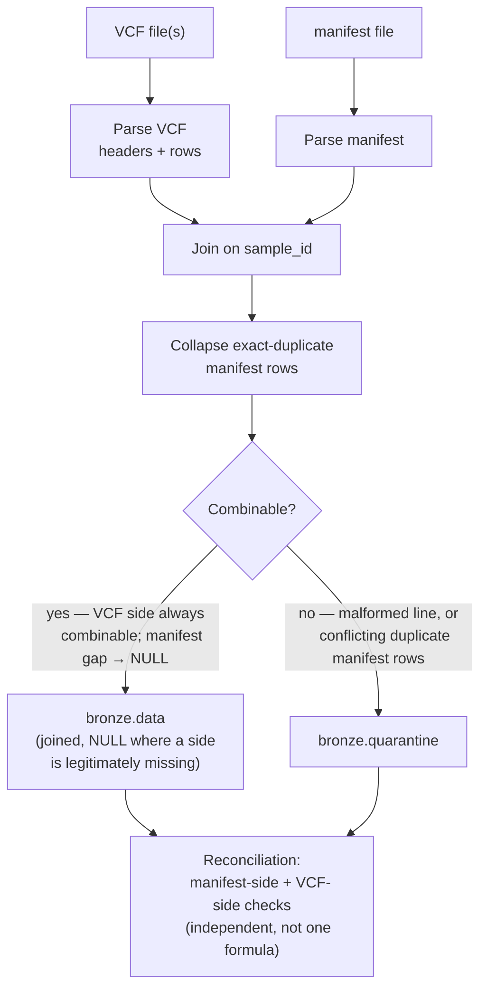

# Bronze layer — `data_loader`

Ingests one batch at a time from `candidate_bundle/data/` into `warehouse/bronze/`:

```bash
uv run data-loader batch_2026_01
uv run data-loader batch_2026_02
```

Equivalent module form: `uv run python -m data_loader batch_2026_01`. Optional flags
(defaults shown): `--data-root candidate_bundle/data --out-root warehouse`.

**Output:** two Parquet files per run, one per batch, never overwritten —

```
warehouse/bronze/data/<batch_id>/data_<timestamp>.parquet
warehouse/bronze/quarantine/<batch_id>/quarantine_<timestamp>.parquet
```

`data` holds every combinable record (joined variant + manifest, `NULL` where a side
is legitimately missing). `quarantine` holds only records that couldn't be parsed or
safely combined at all (malformed lines, conflicting duplicate manifest rows).

> **Status:** bronze layer complete
> (`conductor/tracks/_archive/bronze-layer_20260823/`, all 6 phases). Verified
> against both real batches: `batch_2026_01` → 795 rows written, 2 quarantined
> (`S-0011`'s conflicting manifest duplicate); `batch_2026_02` → 295 rows written, 1
> quarantined (`S-0020`'s truncated line).

**Reads / writes / exit codes:**

| | `data-loader` |
|---|---|
| Reads | `candidate_bundle/data/<batch_id>/` |
| Writes | `warehouse/bronze/{data,quarantine}/` |
| Exit `0` | success |
| Exit `1` | batch folder missing/empty |
| Exit `2` | reconciliation invariant failed |
| Idempotency | new timestamped file per run, **never overwrites** |

## Internal flow



This is bronze's own join-and-dedupe step — a deliberate departure from a
strict medallion pattern where bronze would be a pure landing zone. The
rationale: quarantine here is reserved for records that are genuinely
unresolvable (can't be parsed, or conflict outright), not for anything that's
merely incomplete — an incomplete-but-combinable record still lands in `data`
with `NULL`s, because dropping it would silently lose real variant calls.

---

[← Back to README](../../README.md)
