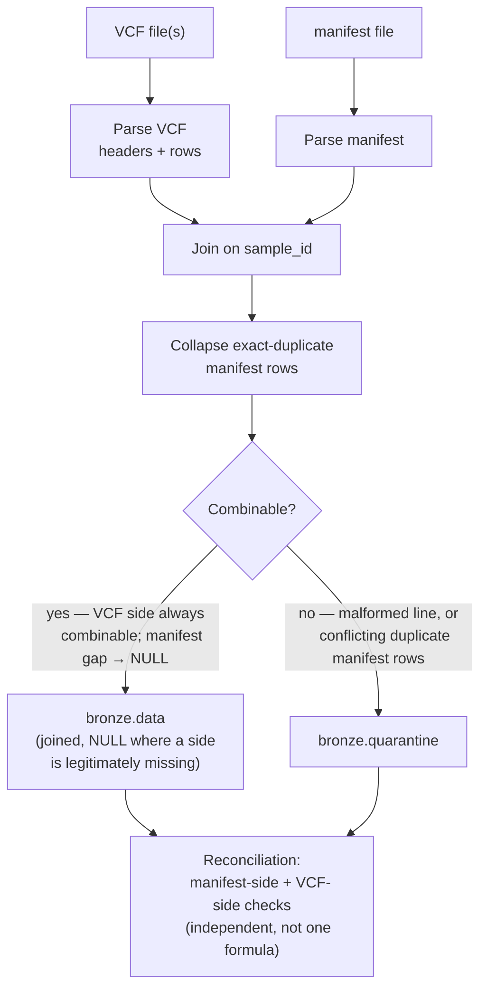

# Bronze layer — `data_loader`

Ingests one batch at a time from `candidate_bundle/data/` into `warehouse/bronze/`.
Equivalent module form: `uv run python -m data_loader batch_2026_01`.

## Command and options

```bash
uv run data-loader <batch_id> [--data-root PATH] [--out-root PATH]
```

| Argument | Required | Default | Meaning |
|---|---|---|---|
| `batch_id` | yes (positional) | — | e.g. `batch_2026_01` — must be a non-empty subdirectory of `--data-root`. |
| `--data-root` | no | `candidate_bundle/data` | Landing-zone root to read `<batch_id>/` from. |
| `--out-root` | no | `warehouse` | Warehouse root; `bronze/data/` and `bronze/quarantine/` are created under it. |

**Example runs:**

```bash
$ uv run data-loader batch_2026_01
batch_2026_01: 795 rows written, 2 quarantined, 0 exact duplicates collapsed

$ uv run data-loader batch_2026_02
batch_2026_02: 295 rows written, 1 quarantined, 0 exact duplicates collapsed

# non-default roots — same effect as the defaults, shown explicitly
$ uv run data-loader batch_2026_01 --data-root candidate_bundle/data --out-root warehouse
batch_2026_01: 795 rows written, 2 quarantined, 0 exact duplicates collapsed
```

**Re-running the same `batch_id`:** bronze never overwrites — each run writes a
new timestamped file, so re-running `batch_2026_01` a second time adds a
*second* `data_<timestamp>.parquet` next to the first one (that's the audit
trail, not a bug). There is no cross-run duplication *within* a file, and
downstream layers never read every bronze file blindly — see silver's
auto-discovery below, which picks exactly one (the latest) file per batch.

**Output:** two Parquet files per run, one per batch, never overwritten —

```
warehouse/bronze/data/<batch_id>/data_<timestamp>.parquet
warehouse/bronze/quarantine/<batch_id>/quarantine_<timestamp>.parquet
```

`data` holds every combinable record (joined variant + manifest, `NULL` where a side
is legitimately missing). `quarantine` holds only records that couldn't be parsed or
safely combined at all (malformed lines, conflicting duplicate manifest rows).

> **Status:** bronze layer complete
> (`conductor/tracks/_archive/bronze-layer_20260823/`, all 6 phases). Verified
> against both real batches: `batch_2026_01` → 795 rows written, 2 quarantined
> (`S-0011`'s conflicting manifest duplicate); `batch_2026_02` → 295 rows written, 1
> quarantined (`S-0020`'s truncated line).

**Reads / writes / exit codes:**

| | `data-loader` |
|---|---|
| Reads | `candidate_bundle/data/<batch_id>/` |
| Writes | `warehouse/bronze/{data,quarantine}/` |
| Exit `0` | success |
| Exit `1` | batch folder missing/empty |
| Exit `2` | reconciliation invariant failed |
| Idempotency | new timestamped file per run, **never overwrites** |

## Internal flow



This is bronze's own join-and-dedupe step — a deliberate departure from a
strict medallion pattern where bronze would be a pure landing zone. The
rationale: quarantine here is reserved for records that are genuinely
unresolvable (can't be parsed, or conflict outright), not for anything that's
merely incomplete — an incomplete-but-combinable record still lands in `data`
with `NULL`s, because dropping it would silently lose real variant calls.

## Inspecting output with the DuckDB CLI

Bronze writes plain Parquet — no database, no server, nothing to load. The
[DuckDB CLI](https://duckdb.org/docs/installation/) queries Parquet files
directly by path (globs work too), which makes it the fastest way to look at
what a run actually produced.

**Prerequisite:** install the CLI binary — it's a separate thing from the
project's Python `duckdb` dependency (which only gives you the library, not
the `duckdb` command):

```bash
brew install duckdb        # macOS
# other platforms: https://duckdb.org/docs/installation/
```

**Case 1 — landed rows, one run:**

```bash
duckdb -c "SELECT * FROM 'warehouse/bronze/data/batch_2026_01/data_<timestamp>.parquet' LIMIT 5"
```

**Case 2 — landed rows, across every run of a batch** (glob instead of one
filename — useful since bronze never overwrites, so a batch dir can hold
several timestamped files):

```bash
duckdb -c "SELECT * FROM 'warehouse/bronze/data/batch_2026_01/*.parquet'"
```

**Case 3 — quarantined rows, with the reason** — `reason_code` is the
machine-readable cause (`CONFLICTING_DUPLICATE`, `MALFORMED_LINE`, ...),
`reason_detail` spells out the specific values that conflicted, `raw_text` is
the original source line:

```bash
duckdb -c "SELECT reason_code, reason_detail, raw_text
           FROM 'warehouse/bronze/quarantine/batch_2026_01/*.parquet'"
```

**Case 4 — one full row, untruncated** — the default table view truncates
wide columns (`info`, `genotype_values`); switch to one-field-per-line inside
the interactive shell instead of piping through `-c`:

```bash
duckdb
D .mode line
D SELECT * FROM 'warehouse/bronze/quarantine/batch_2026_01/*.parquet' LIMIT 1;
```

To find the latest timestamped file for a specific run rather than globbing
every run: `ls -t warehouse/bronze/data/batch_2026_01/*.parquet | head -1`.

---

[← Back to README](../../README.md)
