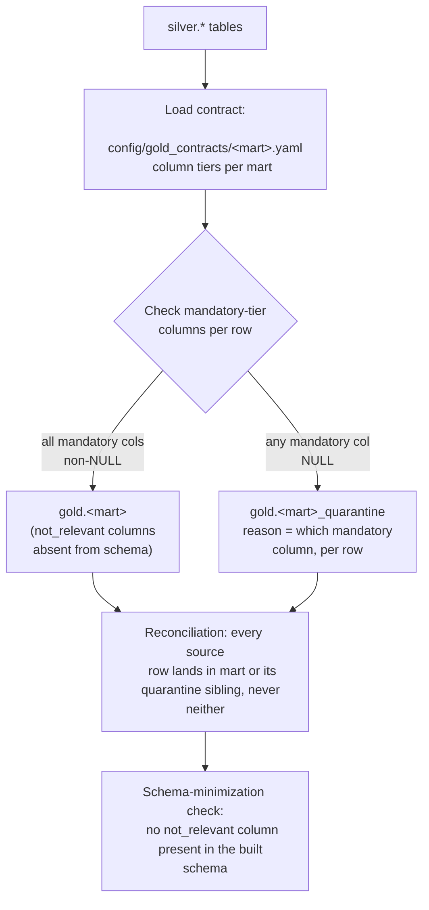

# Gold layer — `gold_builder`

Reads `warehouse/silver.duckdb` and writes **purpose-scoped marts** to
`warehouse/gold.duckdb` — one mart per research question, each with its own
column-relevancy contract rather than one generic schema:

```bash
uv run gold-builder
```

Builds every contract found in `config/gold_contracts/`. To build just one:

```bash
uv run gold-builder --mart gold_variant_gene_lookup_v1
```

**The three marts:**

| Mart | Schema | Grain | Answers |
|---|---|---|---|
| `gold_variant_gene_lookup_v1` | `gold_open` | (sample, variant) | *"Which samples carry a variant in gene X, and what tissue/diagnosis are they from?"* |
| `gold_cohort_gene_burden_v1` | `gold_open` | gene | *"How many variants per gene, and how many distinct patients?"* |
| `gold_sample_clinical_profile_v1` | `gold_restricted` | sample | Full-fidelity clinical context for correlation work needing exact dates/purity |

**Each mart's columns are tiered** `mandatory` / `good_to_have` / `okay_to_have` /
`not_relevant` (`config/gold_contracts/*.yaml`) — only a `mandatory`-tier `NULL`
excludes a row (quarantined, with a reason); lower tiers never exclude, they just
land `NULL`; `not_relevant` columns are dropped from that mart's schema entirely,
not merely left nullable. The same silver row can be excluded from one mart and
fully counted in another — both correct, for different reasons. Concrete, verified
example: `S-0011` (its manifest fields are `NULL` — a bronze-layer decision, not a
defect) is excluded from `gold_variant_gene_lookup_v1` (`tissue` is `mandatory`
there) but its 3 `TP53` variants are still counted in
`gold_cohort_gene_burden_v1`'s `n_variants` — while correctly *not* counted in
`n_distinct_patients` (its `patient_id` is `NULL`, and SQL's
`COUNT(DISTINCT ...)` silently drops `NULL` — a real gap found while building this,
fixed by adding `n_samples_with_unknown_patient` as its own column so the gap is
visible instead of hidden).

> **Status:** gold layer complete
> (`conductor/tracks/_archive/gold-layers_20260823/`, all 6 phases). Verified
> against real silver output: `gold_variant_gene_lookup_v1` → 1032 rows, 57
> quarantined (all `S-0011`); `gold_cohort_gene_burden_v1` → 36 rows (one per
> gene), 0 quarantined; `gold_sample_clinical_profile_v1` → 17 rows, 3 quarantined
> (`S-0003` missing `tumor_purity`, `S-0011` fully `NULL`, `S-0012` missing
> `collection_date` — all three previously-known real gaps in the source manifest,
> not new surprises).

**Reads / writes / exit codes:**

| | `gold-builder` |
|---|---|
| Reads | `warehouse/silver.duckdb` |
| Writes | `warehouse/gold.duckdb` |
| Exit `0` | success |
| Exit `1` | `--silver-db` not found |
| Exit `2` | reconciliation or schema-minimization invariant failed |
| Idempotency | full rebuild (`CREATE OR REPLACE`) every run |

## Internal flow



The contract check runs per-mart, not once globally — the same silver row is
evaluated independently against each mart's own tier list, which is why a row
can be quarantined from one mart and fully counted in another: quarantine here
means "didn't meet *this* mart's contract," not "bad data."

---

[← Back to README](../../README.md)
