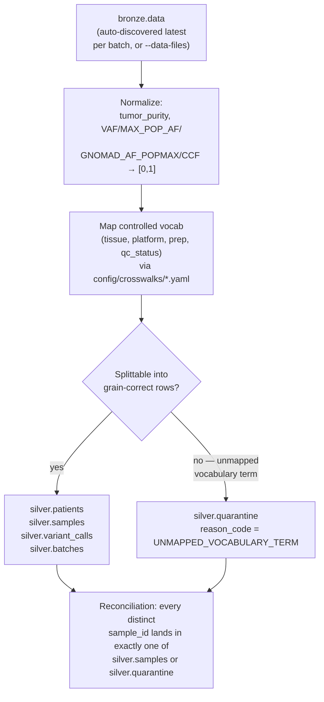

# Silver layer — `silver_builder`

Reads bronze's `data` Parquet output, normalizes types and vocabulary, and writes a
trust-layer schema (patients/samples/variant_calls/batches, plus a
normalization-failure quarantine) to `warehouse/silver.duckdb`.

## Command and options

```bash
uv run silver-builder [--bronze-data-root PATH] [--bronze-quarantine-root PATH]
                       [--data-files FILE [FILE ...]] [--out-root PATH]
```

| Option | Default | Meaning |
|---|---|---|
| `--bronze-data-root` | `warehouse/bronze/data` | Root to **auto-discover** bronze data files under (ignored if `--data-files` is given). |
| `--bronze-quarantine-root` | `warehouse/bronze/quarantine` | Root to auto-discover bronze quarantine files under — used only to report audit counts, doesn't affect what gets built. |
| `--data-files` | none (auto-discover) | One or more explicit `data_*.parquet` paths — **overrides auto-discovery entirely**, useful to rebuild from one specific bronze run while troubleshooting. |
| `--out-root` | `warehouse` | Warehouse root; `silver.duckdb` is written here. |

**Example runs:**

```bash
$ uv run silver-builder
silver_builder: read 1090 rows from 2 bronze file(s) -> 20 samples, 1089 variant calls, 0 quarantined -> warehouse/silver.duckdb

# rebuild from exactly one bronze run, bypassing auto-discovery
$ uv run silver-builder --data-files warehouse/bronze/data/batch_2026_01/data_20260824T124546.parquet
silver_builder: read 795 rows from 1 bronze file(s) -> 20 samples, 795 variant calls, 0 quarantined -> warehouse/silver.duckdb
```

**Does re-running `uv run silver-builder` with no options risk conflicts or
duplicate rows if `data-loader` has been run more than once?** No, for two
independent reasons:

1. **Auto-discovery picks one file per batch, not every file.**
   `discover_bronze_data_files()` lists each `<batch_id>/` subdirectory under
   `--bronze-data-root` and takes only the lexicographically-latest
   `data_*.parquet` in it (the `YYYYMMDDTHHMMSS` timestamp format sorts
   chronologically, so "latest name" = "latest run"). If `data-loader
   batch_2026_01` has been run three times, silver reads only the newest of
   those three files — the older two are ignored, not merged in.
2. **Silver fully rebuilds, it never appends.** Every table is written with
   `CREATE OR REPLACE TABLE` (see below) — running `silver-builder` twice in a
   row with the same bronze inputs produces byte-identical output the second
   time, not double the rows.

**What it does that bronze didn't:**
- Normalizes `tumor_purity` and all VCF-native allele-frequency-like fields
  (`VAF`, `MAX_POP_AF`, `GNOMAD_AF_POPMAX`, `CCF`) to `[0,1]` fractions.
- Maps `tissue`/`sequencing_platform`/`library_prep`/`qc_status` to controlled
  vocabularies via `config/crosswalks/*.yaml` — an unmapped value quarantines,
  never guessed at (see [Next phase: unmapped-vocabulary review](../operations.md#next-phase-unmapped-vocabulary-review)).
- Splits bronze's flat, denormalized rows into grain-correct tables:
  `patients` (one row per patient), `samples` (one row per sample, with a
  `has_variant_data` flag), `variant_calls` (one row per sample × variant).
- Full rebuild every run (`CREATE OR REPLACE TABLE`) — deterministic, no
  incremental-state bugs.

> **Status:** silver layer complete
> (`conductor/tracks/_archive/silver-layer_20260823/`, all 6 phases). Verified
> against real bronze output for both batches: 1090 rows in → 20 samples, 1089
> variant calls, 0 silver-level quarantines (the known real-data defects were
> already handled at bronze). Example queries confirmed against real data: `TP53`
> has 57 variants but only 17 distinct patients — the exact denominator trap
> `n_distinct_patients` exists to prevent.

**Reads / writes / exit codes:**

| | `silver-builder` |
|---|---|
| Reads | `warehouse/bronze/data/` |
| Writes | `warehouse/silver.duckdb` |
| Exit `0` | success |
| Exit `1` | no bronze data files found |
| Exit `2` | reconciliation invariant failed |
| Idempotency | full rebuild (`CREATE OR REPLACE`) every run |

## Internal flow



Grain-splitting happens *after* normalization, not before — a value has to be
on a known scale and in a known vocabulary before it's meaningful to assign it
to `patients` vs. `samples` vs. `variant_calls`. This is also why silver fully
rebuilds every run rather than incrementally patching: a crosswalk update
(new canonical term added) should reclassify every historical row that term
touches, not just new ones.

---

[← Back to README](../../README.md)
