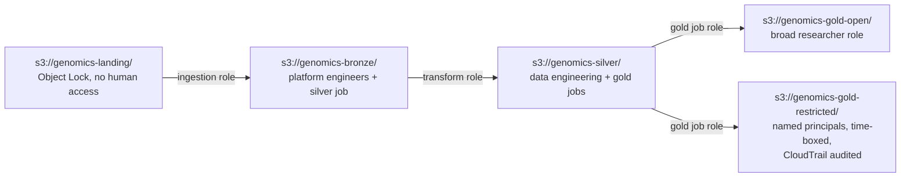

# Governance posture

*(Required by the brief: "how would you handle de-identification and access
control before researchers touch this, and what would you document so an AI
assistant could answer questions on this data reliably?")*

**De-identification is per-tier, not global** — each `gold_open` mart drops
(rather than merely masks) any quasi-identifying column it doesn't need for its
specific purpose (`gold_variant_gene_lookup_v1` never carries `patient_id` or
`collection_date` at all, not even generalised — the question it answers doesn't
need them). `gold_restricted.gold_sample_clinical_profile_v1` carries exact dates
and purity, gated to narrow, named, audited access.

**The honest limitation, stated plainly, not implied away:** at n=20, k-anonymity
is not achievable by generalisation — binning `collection_date` to month only moves
the cohort from 20/20-unique to 9/20-unique (`working_contexts/` v1 §4), and more
fundamentally, **the variant data is itself an identifier** (30–80 common SNPs
uniquely identify a person and their biological relatives) — stripping names from a
VCF is not de-identification in any meaningful sense. **The control is access, not
anonymisation.** Column minimization via the 4-tier contract model reduces each
mart's attack surface; it is not a claim that the data is anonymous.

**The `gold_open`/`gold_restricted` schema split is structural, not enforced
access control** — checked directly: embedded DuckDB has no `GRANT`/role system
(`GRANT SELECT ON SCHEMA ... TO ...` is a parser error). Real enforcement is the
production S3-to-S3 mapping, one IAM role per zone:

Each arrow is a separate IAM role that can read exactly one zone and write exactly
one — no principal can read landing and write gold. *(Full detail:
`working_contexts/` v2 §6.3.)* This repo's local schema split is the structural
analog of that boundary, not the boundary itself.

**What an AI assistant needs, to answer reliably rather than guess:** each mart's
declared `purpose` and `grain` (in its contract YAML, and queryable from
`DESCRIBE`); denominator-safe column names (`n_variants` vs. `n_distinct_patients`
vs. `n_samples_with_unknown_patient` — never a bare `count`); the quarantine
semantics note (a `_quarantine_v1` sibling is *not* bad data — it's data that
didn't meet *that mart's* contract, and may be valid elsewhere); and the fact
that `not_relevant` means a column is absent, not that it happened to be `NULL`.

---

[← Back to README](../README.md)
