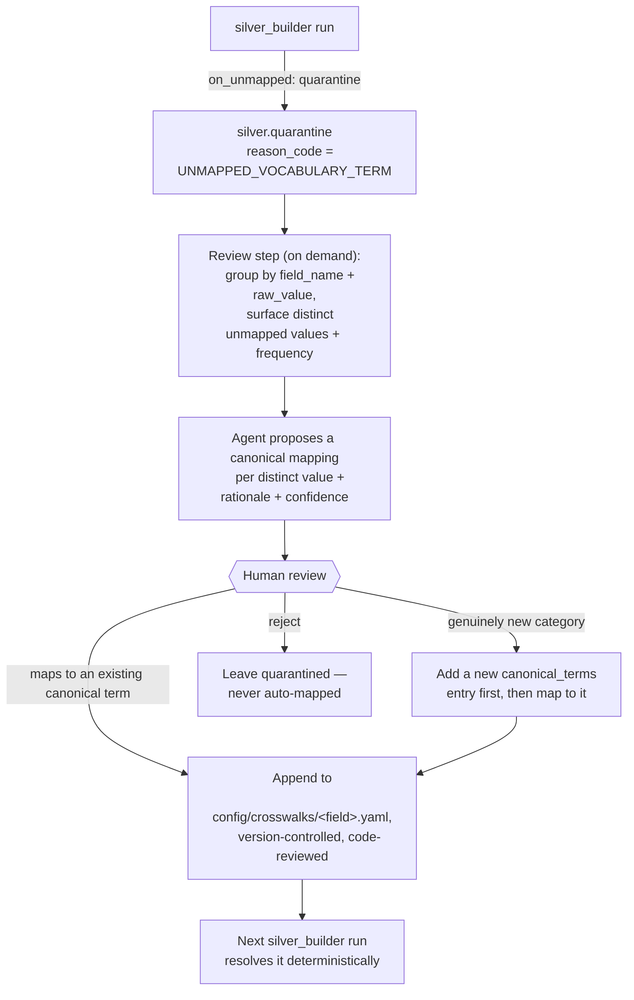

# Operational posture

**Idempotency means something different at each layer, deliberately:**

- **Bronze keeps every run.** Each run of `data_loader` writes a brand-new
  timestamped file and never deletes or overwrites a previous one — bronze is the
  audit trail. Re-running twice produces two files, not data loss or duplication
  within a file.
- **Silver and gold fully rebuild.** Both use `CREATE OR REPLACE TABLE` from
  whatever bronze/silver output they're pointed at — deterministic,
  no incremental-state bugs, but a run genuinely replaces the previous one. Silver
  and gold are *current-best-understanding*, not an audit trail — that's bronze's
  job, and only bronze's.

**Every layer enforces a reconciliation invariant before declaring success** — a
non-zero exit `2` means the invariant failed, which is a bug in the code, never a
property of messy input data (messy input is handled by quarantine, which is exit
`0`):

- Bronze: **two independent checks**, not one combined formula (a single equation
  doesn't actually balance once the manifest↔VCF join's merge behavior is accounted
  for) — manifest: `lines_read == usable + quarantined + duplicates_collapsed`;
  VCF: `lines_quarantined <= lines_read`.
- Silver: every distinct `sample_id` in the bronze input lands in exactly one of
  `silver.samples` or `silver.quarantine`.
- Gold: per mart, every source row lands in exactly one of the mart or its
  `_quarantine` sibling (the aggregate mart's version: `sum(n_variants) +
  quarantined == source row count`).

**Troubleshooting a non-zero exit:** exit `1` across all three tools means "nothing
to read" (check the path you passed); exit `2` means a reconciliation assertion
failed — re-run with the same inputs isolated (e.g. `--mart` on `gold-builder`, or a
single `--data-files` on `silver-builder`) to narrow down which record broke the
invariant, and treat it as a bug to fix in the layer that raised it, not a data
problem to route around.

## Next phase: unmapped-vocabulary review

`working_contexts/` v2 §4.4 designed an **agentic authoring loop** for silver's
vocabulary crosswalks: an agent proposes a canonical mapping, a human approves it,
the mapping is committed to `config/crosswalks/*.yaml`, and the pipeline itself
stays a pure, deterministic lookup at runtime — never an LLM call in the execution
path. That runtime half is built. **The authoring-loop half — what happens the
*next* time an unmapped value shows up — is not yet a distinct tool.** Today,
`on_unmapped: quarantine` is the entire story: an unrecognized value lands in
`silver.quarantine` and stops there.

Recommended flow for the next phase, kept deliberately **separate** from the three
existing pipeline CLIs — it runs on demand against accumulated quarantine data, not
as part of any deterministic run:

Why this shape: never automatic (same human-approval boundary v2 §4.4 already
drew, just extended to future values); batch-triggered rather than continuous
(keeps the pipeline itself fast and deterministic); the commit is the audit trail
(a crosswalk change is a normal, reviewable git diff, not "the model decided");
and rejection is a valid outcome (not every unmapped value should be force-mapped —
some are genuinely bad data). **Not built this pass** — a small CLI following the
same pattern as the three existing tools, recorded here as a deliberate deferral
with a reason, not a silent gap.

---

[← Back to README](../README.md)
